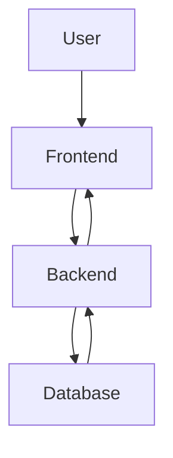
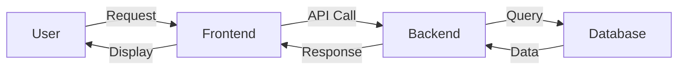
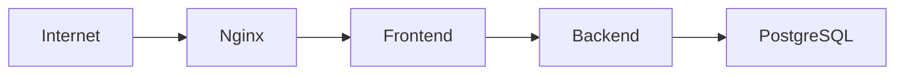
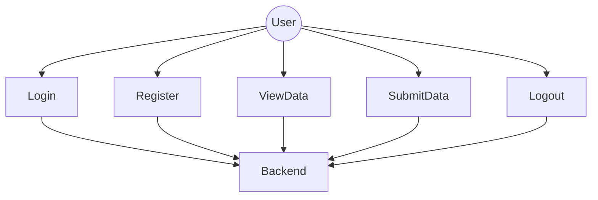

# 🚀 Major Project

A full-stack web application built using modern technologies with Docker-based deployment.  
The system consists of a frontend client, backend API, and PostgreSQL database.

---

## 📌 Project Overview

This project is designed with a clean architecture separating:

- 🖥 Frontend (Client)
- ⚙ Backend (API Server)
- 🗄 Database (PostgreSQL)
- 🐳 Docker for containerized deployment

The system follows a standard request-response model where the frontend communicates with backend APIs, and the backend interacts with the database.

---

## 🛠 Tech Stack

| Layer       | Technology |
|------------|------------|
| Frontend   | TypeScript / JavaScript |
| Backend    | Python |
| Database   | PostgreSQL |
| DevOps     | Docker & Docker Compose |

---

## 📂 Project Structure

```
Major/
│
├── backend/              # Backend API logic
├── client/               # Frontend application
├── db/                   # Database configuration
├── docker-compose.yml    # Multi-container setup
└── README.md
```

---

# 🏗 System Architecture



---

# 🔄 Data Flow Diagram (DFD - Level 1)



---

# 🌐 Network Diagram



Explanation:

- User accesses application via Internet
- Reverse proxy (optional: Nginx)
- Backend and DB communicate inside Docker network

---

# 👤 Use Case Diagram



---

# 🚀 How to Run the Project

## 1️⃣ Clone the Repository

```bash
git clone https://github.com/yourusername/Major.git
cd Major
```

## 2️⃣ Run Using Docker

```bash
docker compose up --build
```

## 3️⃣ Access Application

| Service | URL |
|---------|------|
| Frontend | http://localhost:3000 |
| Backend | http://localhost:8000 |
| Database | localhost:5432 |

---

# 🔐 Environment Variables

Create a `.env` file if required:

```
POSTGRES_USER=postgres
POSTGRES_PASSWORD=password
POSTGRES_DB=major_db
SECRET_KEY=your_secret_key
```

---

# 🧪 Future Enhancements

- Authentication & JWT
- Role-based Access Control
- CI/CD Integration
- Kubernetes Deployment
- Unit & Integration Testing

---

# 📄 License

This project is for educational purposes.

---

# 👨‍💻 Author

Gunavardhan Lomada  
Computer Science Student
